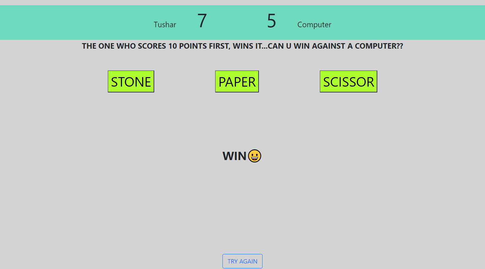
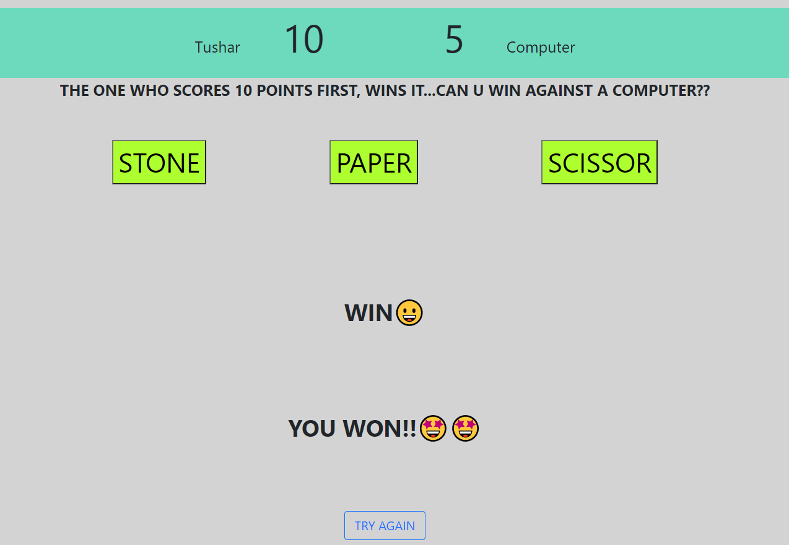

# STONE PAPER SCISSOR GAME

I created a very simple game, known as Stone Paper Scissors, exactly the one that we used to play in our childhood. The game is made with the help of basic HTML, CSS and JAVASCRIPT. 

The game is simple, the one who score 10 points first, wins, You or the computer. Do you dare to take this challenge??

 
 

 
 
** You might not see any commits history, reason being I didn't know how to use git at that time 😅. Apologies for the same!
